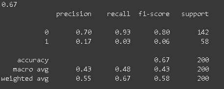

# fraud detection in insuarance claims

## project summary
This project focuses on detecting fraud in insurance claims using machine learning. Insurance fraud is a major problem that costs companies a lot of money each year. The goal of this project is to build a model that can identify which claims are likely to be fraudulent, helping insurance companies save time and reduce losses.

Using a dataset of past insurance claims, the model learns patterns in the data to tell the difference between normal and suspicious claims. The project includes data cleaning, feature engineering, model training, evaluation, and explainability. It also aims to make the predictions easy to understand, so that users can trust and act on the model’s decisions.

## problem definition 
Insurance companies receive thousands of claims every day. Some of these claims are honest, but others are fake or fraudulent. Detecting fraud manually takes a lot of time and effort, and it’s easy to miss hidden patterns.

The problem is to find a way to automatically detect which insurance claims are likely to be fraudulent. This can help insurance companies take quick action, reduce financial losses, and improve trust with their customers.

## project goal
-to build a machine learning model that can analyze claim data and predict whether a claim is genuine or fraudulent.

## project objectives
-preprocess data: clean the data by handling missing values,encoding categorical features, scaling numerical values
- understanding data:exploring and anlyzing the dataset to identify key patterns and insights
- split the data to train and test data
- build a fraud detection model :train machine learning models to classify claims as fradulent or genuine
- evaluate the model's perfoamnce: use metrics like accucary, classification matrix,precision, recall and f1-score to meause  how weel the model perfoms on the trained data and unseen data.

## dataset description
In this study, we have used Kaggle provided dataset of Auto Insurance Claim contains 1000 rows and 40 columns shape.

Column Name	Describe
Policy_annual_premium	Amount of insured need to pay over the year
Insured_zip	Insured number
Capital-gains	Profit on earns of the sales
Capital-loss	Loss incurred
Incident_hour of the day	Hour of the day incident occurred
Total claim amount	Total Amount of claims
Injury claim	Amount of injury claims
Property claim	Amount of property claim
Vehicle claim	Amount of vehicle claim
Policy_state	State of policy holder
Policy_csl	Combined single limit of policy
Policy_deductable	Amount of first pay
Insured_sex	Gender
Insured_hobbies	Hobby of insured
Incident_type	Type of incident occurred
Collision_type	Type of damaged parts
Incident_severity	Type of severity damaged
Authorities contacted	Type of authorities has contacted on incident
Incident_state	State of incident
Incident_city	City of incident
Number of vehicle	Number of vehicle involved
Property damaged	Property damaged or not
Bodily injuries	Number of bodily injured
Witnesses	Number of witnesses
Auto_year	Year of auto model
Police_report	Available or not
Auto_make	Fabrication of Auto
Auto_model	Auto model

## approach and methodology
A) Exploratory Data Analysis
- i explored the data to understand patterns and relationships.I visulaized different features to undersand them(univariate) . i also visulaized differnt features  with others like the lables to undersand the data and its distribution.

B)data preprocessing
-here, i checked for missing values  and filled them using the 'bfill\ffill' method.
- i checked each feature to ensure all the variables did bot have special cahracters and those that did, i replaced them
- i then encoded each categorical feature separately using encoders like OneHotEncoder, LabelEncoders, frequency encoders
- to ensure that the features where of the same scale, i used a scaler:min-max scaler
- lastly, i splitted by data into testing and training sets

C) model selection and training
-the dataset was labelled, hence, supervised learning.
- the goal was to classify the frauds into yes/no, hence the use of a classifier.
- i used two models: Logistic Regression and RandomForest Classifier

D)model evaluation
- i first trained  using logistic regression. the model performed preety fairy with an accuracy on 67%.i then noticed that the model was biased towards the 0 category.

E) handling class imbalance
- before contuning to use random forest, i used the RandomOverSampler to reduce the imbalanceness in the classes
- i then trained ane tested using Logistic Regression and RandomForest.the logisic regression rerutned an accuracy of 62% and perfomed faily on both classes.
- when i used the RandomForest, i got an accuracy of (91%  on training and 89% on testing) and it perfomed exepotannly well on both classes.

  (3.png)

